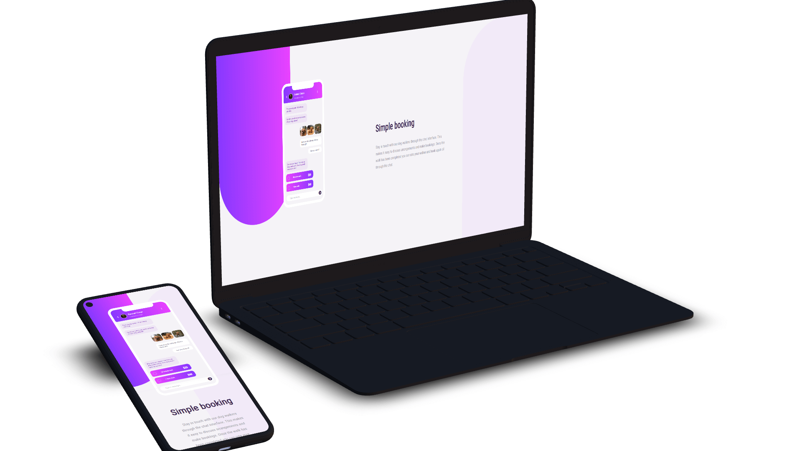

# Frontend Mentor - Chat app CSS illustration solution

This is a solution to the [Chat app CSS illustration challenge on Frontend Mentor](https://www.frontendmentor.io/challenges/chat-app-css-illustration-O5auMkFqY). Frontend Mentor challenges help you improve your coding skills by building realistic projects.

## Overview

### The challenge

Users should be able to:

- View the optimal layout for the component depending on their device's screen size.
- **Bonus**: See the chat interface animate on the initial load.

### Screenshot



### Links

- Solution URL: [Add solution URL here](https://github.com/terencecistudent/Chat-App-CSS-Illusion)
- Live Site URL: [Add live site URL here](https://terencecistudent.github.io/Chat-App-CSS-Illusion/)

## My process

### Built with

- Semantic HTML5 markup
- CSS custom properties
- Flexbox
- SASS
- Mobile-first workflow

### What I learned

Building this application was a great way for me to practice my CSS layout skills using flexbox while using SASS. Below is a screenshot of some SASS where I called a mixin in a different file using the @include component. My knowledge in SASS has grown thanks to completing this challenge.

To see how you can add code snippets, see below:

```sass
@include mobile {
  .left-background__style {
    width: 11.75rem;
    height: 31.125rem;
    background: linear-gradient(to right, $light-violet, $light-magenta);
    border-radius: 0 0 225px 0;
    position: absolute;
    top: 0;
    left: 0;
  }
}
```

### Continued development

In the future, I am going to continue using SASS to use more functionality it has to offer. Another area I would like to work on is using the grid system.

### Useful resources

- [Font Awesome](https://fontawesome.com/) - This helped me to implement icons which are used on the phone.

## Author

- Website - [Terence Logue](https://www.terence-logue.com)
- Frontend Mentor - [@terencecistudent](https://www.frontendmentor.io/profile/terencecistudent)
- Twitter - [@terence_logue](https://twitter.com/terence_logue)

## Acknowledgments

Thanks to Frontend Mentor for inpsiring me to create this difficult challenge.
